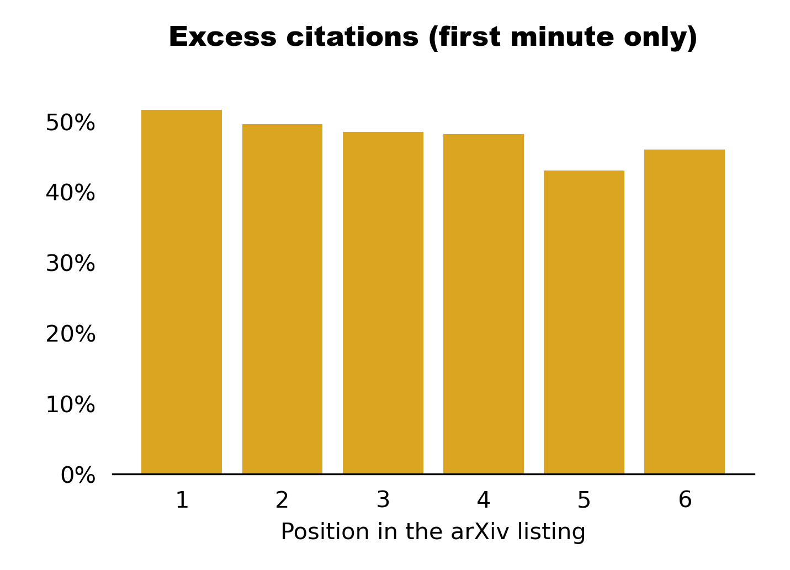

# arxiv_submission_analysis
In grad school I heard that papers submitted to arXiv right after the deadline get the first position in the listing and are thus cited more. 
Here is the code looking into this question using hep-th submissions from 2017-2020.

It turns out that papers that appeared as the first listing are indeed more cited:

However, if we look only at papers submitted in the first minute after the deadline there is not a very big dependence on where in the listing the paper appeared:

Also, the papers that appeared as the first listing but were not submitted in the first minute after the deadline receive 4% less citations than expected
and not 30+% more as the first graph suggests.

So overall it seems that the "first listing" effect exists, but is not actually driven by at which arXiv position the paper appears but by the demographics of the people 
who submit their papers right after the deadline. Possibly, these submitters who were exposed to the "first listing" lore are better networked than the rest or are 
additionally exposed to other similar (and more useful) advice about how to promote their papers, which gives them advantege.

# Codes:

kaggle.py      - process the arXiv papers, extract necessary data (also https://www.kaggle.com/motloch/arxiv-analysis)

inspire_hep.py - download the number of citations from the INSPIRE database (https://inspirehep.net)

analyze.py     - create plots with results, print some basic statistics
